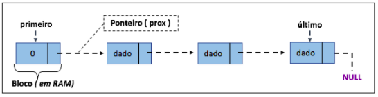

# MÁXIMA SOMA
Em uma lista A temos um conjunto de elementos inteiros positivos ou não <a1; a2; ... ; an>. Elabore uma função que consiga encontrar neste conjunto a máxima soma.
# Logica
Foi-se feito um programa com a seguinte lógica:    
Existe uma lista dinâmica **l** da maneira:
>

>A lista dinâmica é uma variante do modelo estático [vide git](https://github.com/mpiress/linear_list). Assim, antes de apresentar as modificações existêntes nessa implementação, vejamos uma representação gráfica do modelo dinâmico em questão. Observe as nomenclaturas utilizadas na figura, essas são utilizadas na implementação fornecida, as quais podem estar definidas/parametrizadas no idioma inglês.
>

>

>	 
>

>

>Note pela figura que, o primeiro bloco armazenado em RAM não apresenta o tipo dado como parte da estrutura, mas sim um valor 0 <b>"simbólico"</b>. Isso porque é >preciso inserir na estrutura o que chamaremos de cabeça da lista. A cabeça de uma lista nada mais é que um ponteiro <i>vazio</i> (i.e., um tipo similar ao void) que >indica qual posição de memória será utilizada como base/início da lista. 
>

>

>Uma outra nomenclatura a ser observada na figura é a existência de um ponteiro <b>prox</b>. Este tem por objetivo apontar para o próximo bloco de memória que conterá >o novo dado ou para NULL, o que facilita a navegação entre os blocos e a idenficação do fim da lista. Este ponteiro se mostra imprescindível, uma vez que abandonamos >o modelo sequencial de memória e adotamos um conceito cujos blocos estão em endereços aleatórios. Nesse novo modelo, inserções, remoções, pesquisas e impressões da >lista são apoiadas por dois outros ponteiros, o <b>primeiro</b> e o <b>último</b>, conforme representação da figura.
>

>Qual a função dos ponteiros <b>primeiro</b> e <b>ultimo</b>?
>
> Como a lista é composta de blocos espalhados na memória, torna-se necessário identificar qual bloco representa a cabeça da lista. Para isso, é utilizado o ponteiro primeiro. Da mesma forma, identificar o último bloco também se torna importante, uma vez que, novas inserções são realizadas sempre no final dessa estrutura com o objetivo de facilitar sua manipulação.
>

>Se considerarmos um computador hipotético com 8Mb de RAM distribuídos em dois pentes de 4Mb cada, uma representação da lista dinâmica poderia ser compreendida da seguinte forma:
>

>

>	 
>
 

1) Ao entrar no programa a primeira função encontrada é *preencherMatriz(&m)*, que preenche uma **Matrix** m de tamanho MATTAM x MATTAM (Definido em matrix.h) com números aleatórios de 0 a 99, além de tornar os valores dos integers de posição e passagem para 0/false;    

2) A segunda função *printaMatrix(&m)* tem o objetivo de mostrar a **Matrix** m após seu preenchimento;     

3) A terceira função *andarMatriz(&m)* possui a seguinte lógica:    
         &nbsp;&nbsp;&nbsp;&nbsp;&nbsp;&nbsp;&nbsp;Enquanto a posição atual não for igual a ultima:     
         &nbsp;&nbsp;&nbsp;&nbsp;&nbsp;&nbsp;&nbsp;Checa para saber em qual dos quadrantes abaixo a posição atual está     

 

&nbsp;&nbsp;&nbsp;&nbsp;&nbsp;&nbsp;&nbsp;Lógica para cada quadrante:

- Amarelo: 
    1. Checa se o de baixo>=direita, se sim:
        - Caminha para baixo;
    2. Caso contrário:
        1. Checa se o da direita já foi passado, se não:
            - Caminha para direita;
        2. Caso contrário 
            - Caminha para baixo;

- Vermelho: 
    - Caminha para baixo;

- Verde: 
    1. Checa se o de baixo>=esquerda, se sim:
        - Caminha pra baixo;
    2. Caso contrário:
        1. Checa se o da esquerda já foi passado, se não:
            - Caminha para esquerda
        2. Caso contrário:
            - Caminha para baixo;

- Roxo: 
    - Caminha para direita;

- Azul:
    1. Checa se o de baixo>=direita e baixo>=esquerda, se sim:
        - Caminha para baixo;
    2. Caso contrário, checa se o da direita>=baixo e direita>=esquerda:
        1. Checa se o da direita já foi passado, se não:
            - Caminha para direita;
        2. Se sim:
            1. Checa se o de baixo>=esquerda, se sim:
                - Caminha para baixo;
            2. Se não:
                - Caminha para esquerda;
    3. Caso contrário:
        1. Checa se o da esquerda já foi passado, se não:
            - Caminha para esquerda;
        2. Se sim:
            1. Checa se o de baixo>=direita, se sim:
                - Caminha para baixo;
            2. Se não:
                - Caminha para direita;   
  
Obs.:    
- Caminhar quer dizer somar 1 à linha ou coluna atual, e tornar a verificação de passagem dessa posição como true;
- A cada ciclo é somado 1 em um contador de passos;
- A cada ciclo é somado o valor do item a um somatório do caminho;

Ao final do ciclo é impressa a soma dos passos e o somatório do caminho;

4) A quarta função *printCaminho(&m)* mostra a relação de 1 e 0 para cada posição do caminho percorrido, sendo 1=passou e 0=não passou;

# Perguntas

1) Há mais de uma maneira de resolver esse problema ?    
R: Creio que sim, algo relacionado a ordenação pode ser possível;   

2) Há algoritmos em literatura que resolvam esse problema ?    
R: Dando uma passada de olho no livro base da disciplina por Cormen, acredito que o capítulo 16 "Greedy Algorithms" pode ser utilizado para resolver o problema;    

3) Pode existir mais de um caminho cujo valor total é o maximo?     
R: Claro, no caso de a matriz ser igual, um caminho que começa para direita e um caminho que começa pra baixo teriam a mesma soma total;     

# Compilação e Execução

O programa possui um arquivo Makefile que realiza todo o procedimento de compilação e execução. Para tanto, temos as seguintes diretrizes de execução:

| Comando                |  Função                                                                                           |                     
| -----------------------| ------------------------------------------------------------------------------------------------- |
|  `make clean`          | Apaga a última compilação realizada contida na pasta build                                        |
|  `make`                | Executa a compilação do programa utilizando o gcc, e o resultado vai para a pasta build           |
|  `make run`            | Executa o programa da pasta build após a realização da compilação                                 |
